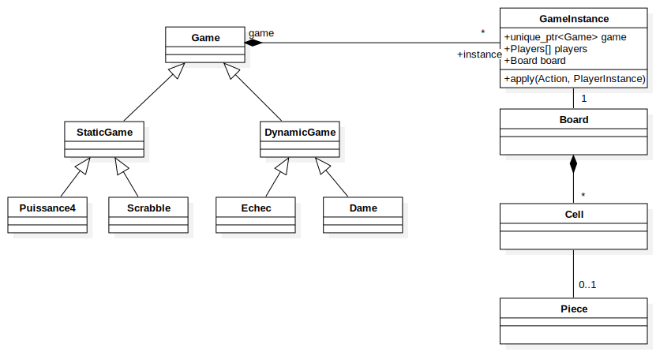
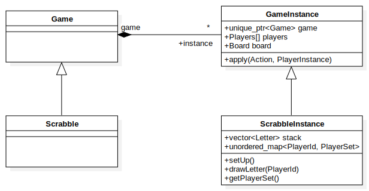
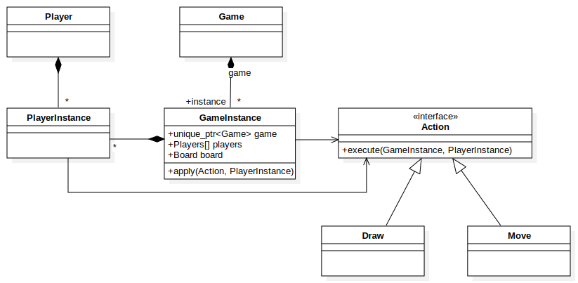

# CWebScrabble

## Project

Playing Scrabble with my grandmother during the next holidays.

## Diagrams

```bash
# remove UNREGISTERED from .svg files :
sed -i 's/UNREGISTERED//g' Model\!Action_1.svg Model\!Instance_2.svg Model\!Main_0.svg
```

### Global implementation

I'm working to applied SOLID model concept in this project.
I have multiples high level object as Game, Board, GameEngine...

Game is an object who know the rules, how to win, how to apply actions... And GameEngine is an instance with GameState so you will have


### Close relationship



### Action role


